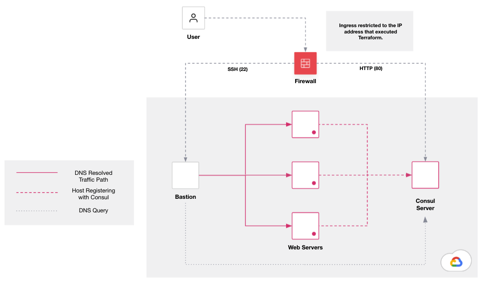

# Consul Service Discovery on Google Cloud
This repo deploys an environment to demostrate Consul's service registry using virtual machines.

## Diagram


## Dependancies
- Google Cloud Project
- Google Compute API enabled in project
- Google Service Account JSON with permissions to said project
- `packer` and `terraform` binaries installed in your $PATH

## High level workflow
1. Set env vars
2. Build VM images for Bastion, Consul and the Web Server.
3. Deploy environment with Terraform.

### 1. Set env vars
Set the path to your Google cloud credentials.
```
export GOOGLE_APPLICATION_CREDENTIALS="~/.credentials/gcp.json
export GOOGLE_BACKEND_CREDENTIALS="~/.credentials/gcp.json"
```

To make sure that the images are available in the correct project, we set the project name here and use the same env vars in all of the `packer` config.

Make sure your Google Cloud project is correctly configured for Packers SSH access.

It would be nice if terraform supported `env("env")` but it doesn't. Likely move to shared `.hcl` file at some stage.
```
export GCP_PROJECT="devopstower"
```

## 2. Building Images

### Building the bastion image.
This is the packer config i use for my bastion, feel free to use this, or replace it with any other linux image that has the Consul binary installed.
```
cd build/bastion
packer build soe.pkr.hcl
```

### Building the Consul Enterprise image
This is a linux image with the Consul Enterprise binary running in server mode.
```
cd build/consul
packer build consul.pkr.hcl
```

### Building the Web Server image
This is a linux image with Apache and the Consul agent running.
```
cd build/web
packer build web.pkr.hcl
```

## 3. Deploying the environment
Most of what you'd want/need to customise are in `terraform.tfvars`.
```
vim deploy/terraform.tfvars
```

Start the deployment.
```
cd deploy
terraform init
terraform apply -auto-approve
```

### ToDo
- Implement Consul Service Mesh
- Shared `.hcl` between Terraform and Packer.
